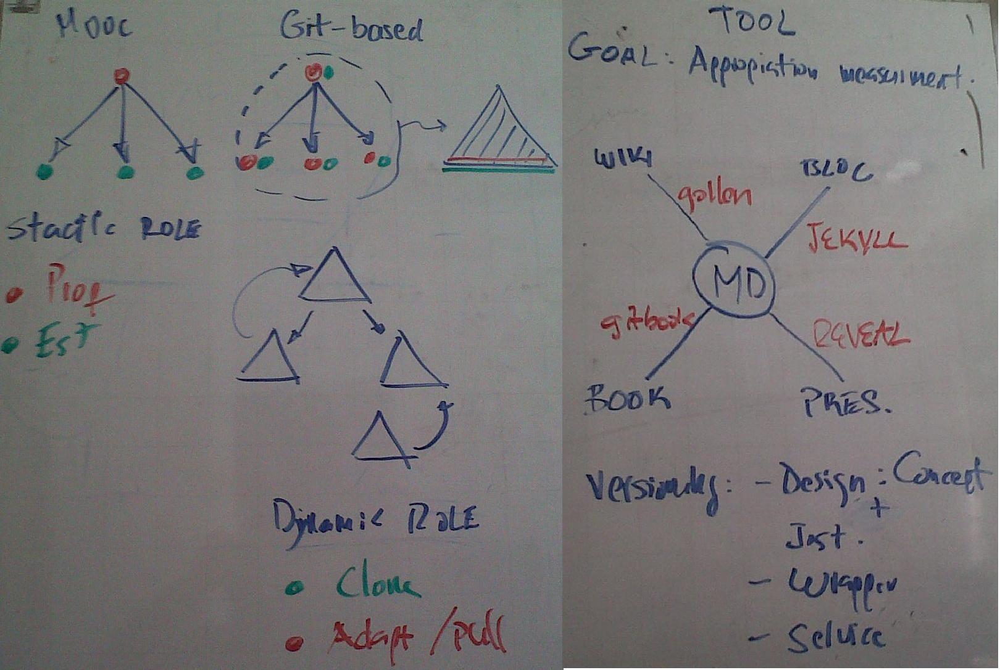

<!-- configuracion de colores es opcional pero ultil-->
<section id="themes">
	<h2>Configuración de temas</h2>
	

		Temas:  
		<a href="?#/themes">Default</a> -
		<a href="?theme=sky#/themes">Sky</a> -
		<a href="?theme=beige#/themes">Beige</a> -
		<a href="?theme=simple#/themes">Simple</a> -
		<a href="?theme=serif#/themes">Serif</a> -
		<a href="?theme=night#/themes">Night</a>  
		<a href="?theme=moon#/themes">Moon</a> -
		<a href="?theme=solarized#/themes">Solarized</a>
	

</section>

Slide:

#Software para la 
#colaboración

Franchesco Mora

Slide:

# Agenda

* La siguiente agenda se elabora con base en el capítulo 2 del libro de Karl Fogel: Producing Open Source Software

[Descargar el libro en español](http://producingoss.com/es/producingoss.pdf)

[Descargar el libro en Inglés](http://www2.econ.iastate.edu/tesfatsi/ProducingOSS.KarlFogel2005.pdf)

Slide:

# Agenda

* Primero investiga
* Empezando con lo que se tiene
* Escogiendo una licencia y aplicándola
* Ajustar el tono
* Anunciar

Slide:

## Primero investiga(1/2)

* "Siempre investiga si existe un proyecto que hace lo que deseas."

Sitios web que ofrecen cursos MOOC:

* [Coursera](https://www.coursera.org/)
* [Udacity](https://www.udacity.com/)
* [edX](https://www.edx.org/)
* [Khan Academy](https://www.khanacademy.org/)
* [Udemy](https://www.udemy.com/)
* [Codecademy](http://www.codecademy.com/)
* [Lynda.com](http://www.lynda.com/)
* [SkilledUp](http://www.skilledup.com/)
* [Academic Earth](http://academicearth.org/)
* [Saylor.org](http://www.saylor.org/)

Slide:

## Primero investiga(2/2)

* [Canvas Network](https://www.canvas.net/)
* [MiríadaX](http://miriadax.net/)
* Ver presentación completa sobre los MOOC [aquí](http://franchescomora.github.io/presentacion-estado-del-arte/#/1)

Slide:

## Empezando con lo que se tiene

* "Lo más difícil acerca de lanzar un proyecto de software libre es transformar una visión privada a una pública." <!-- .element: class="fragment" data-fragment-index="1"-->
* Organizar y documentar<!-- .element: class="fragment" data-fragment-index="2"-->
* Llevar el proyecto a un tipo de activación de energía mínima<!-- .element: class="fragment" data-fragment-index="3"-->
* Hacktivation energy: la cantidad de energía que debe aportar un recién llegado antes de recibir algo a cambio.<!-- .element: class="fragment" data-fragment-index="4"-->
* Mientras menor sea ésta energía, mejor. La primera tarea es hacer descender ésta hacktivation energy a niveles que animen a la gente a involucrarse.<!-- .element: class="fragment" data-fragment-index="5"-->

Subslide:

## Escoger un buen nombre

* Da cierta idea de lo que el proyecto hace.<!-- .element: class="fragment" data-fragment-index="1"-->
* Es fácil de recordar.<!-- .element: class="fragment" data-fragment-index="2"-->
* No tiene el mismo nombre que otro proyecto y no infringe ninguna marca comercial. <!-- .element: class="fragment" data-fragment-index="3"-->
* Está disponible como un nombre de dominio .com, .net, y .org.<!-- .element: class="fragment" data-fragment-index="4"-->

Subslide:

## Tener los objetivos claros(1/3)

* "Una vez que se ha encontrado el sitio del proyecto, lo siguiente que la gente hace es buscar por una descripción rápida, una declaración de objetivos, para poder decidir (en menos de 30 segundos) si están o no interesados en aprender más. Esto debe estar en un lugar prioritario en la página principal,preferiblemente justo debajo del nombre del proyecto."

Subslide:

## Tener los objetivos claros(2/3)

* Objetivo general: <!-- .element: class="fragment" data-fragment-index="1"-->

* Diseñar e implementar una metodología colaborativa entre los distintos actores del sistema educativo colombiano, mediante lo que se conoce como software para la colaboración, buscando lograr una efectiva apropiación del conocimiento académico por parte de los estudiantes de todos los niveles de formación en el país.<!-- .element: class="fragment" data-fragment-index="2"-->

* La declaración de los objetivos debe ser concreta, limitada y sobre todo, corta.<!-- .element: class="fragment" data-fragment-index="3"-->

Subslide:

## Tener los objetivos claros(3/3)

* Objetivos específicos:

* a. Desarrollar la noción de apropiación del conocimiento académico, identificando sus clases y la manera como se puede medir.<!-- .element: class="fragment" data-fragment-index="1"-->
* b. Establecer qué tipos de software para la colaboración hay (tanto libres como propietarios).<!-- .element: class="fragment" data-fragment-index="2"-->
* c. Determinar la relación existente entre la apropiación del conocimiento académico y el software para la colaboración.<!-- .element: class="fragment" data-fragment-index="3"-->
* d. Reconocer cómo el software para la colaboración puede potenciar la apropiación del conocimiento académico<!-- .element: class="fragment" data-fragment-index="4"-->

Subslide:

## Declara que el proyecto es libre

* La página principal debe poner claramente y sin ambigüedades que el proyecto es open source.<!-- .element: class="fragment" data-fragment-index="1"-->
* "Una omisión como ésta puede haceros perder muchos desarrolladores y usuarios potenciales."<!-- .element: class="fragment" data-fragment-index="2"-->

Subslide:

### Lista de características y requerimientos

* "Debería haber una breve lista de las características que el software soporta (si algo aun no ha sido completado, se puede listar de todas formas, pero señalando "planeado" o "en progreso") y el tipo de entorno necesario para ejecutar la aplicación."<!-- .element: class="fragment" data-fragment-index="1"-->
* Hay que pensar en ésta lista como algo que daríamos a alguien que requiere un resumen de nuestro programa.<!-- .element: class="fragment" data-fragment-index="2"-->

Subslide:

## Estado del desarrollo

* "Se debe suministrar una página que muestre el estado del desarrollo,listando los objetivos a corto plazo del proyecto y las necesidades (por ejemplo, quizás se estén buscando desarrolladores con un expertos en un tema en particular)."<!-- .element: class="fragment" data-fragment-index="1"-->
* "No hay que asustarse por parecer no estar preparado y no caer en la tentación de inflar el estado del desarrollo."<!-- .element: class="fragment" data-fragment-index="2"-->

Subslide:

## Estado del desarrollo

Subslide:

## Descargas
* El software debe poder ser descargable como código fuente en formatos estándares.<!-- .element: class="fragment" data-fragment-index="1"-->
* El mecanismo de distribución debe de ser de lo más conveniente, estándar y sencillo posible.<!-- .element: class="fragment" data-fragment-index="2"-->
* Cuando se lanza un paquete descargable, es vital que se le dé un número de versión único a éste lanzamiento, de manera que la gente pueda comparar dos versiones cualquiera diferentes y saber cual reemplaza a cual. <!-- .element: class="fragment" data-fragment-index="3"-->

Subslide:

## Control de versiones y acceso al Bug Tracker
* Las personas necesitan de acceso en tiempo real a los últimos cambios,y la manera de proporcionarles esto es utilizando un sistema de control de versiones.<!-- .element: class="fragment" data-fragment-index="1"-->
* La presencia de fuentes controladas accesibles es una señal de —para ambos,usuarios y programadores— que éste proyecto ésta haciendo un esfuerzo en proporcionar todo lo necesario para que otros participen.<!-- .element: class="fragment" data-fragment-index="2"-->
* Lo mismo se aplica para el seguimiento de errores del proyecto.<!-- .element: class="fragment" data-fragment-index="3"-->

Subslide:

## Canales de comunicación

* Usualmente los visitantes desean saber cómo pueden contactar con los seres humanos detrás del proyecto.<!-- .element: class="fragment" data-fragment-index="1"-->
* Hay que suministrar direcciones de listas de correo, salas de chat, canales en IRC y cualquier otro foro donde aquellos involucrados puedan ser contactados.<!-- .element: class="fragment" data-fragment-index="2"-->
* Deben existir foros de comunicación, tanto para usuarios como para desarrolladores.<!-- .element: class="fragment" data-fragment-index="3"-->

Subslide:

## Pautas de Desarrollo

* Si alguien considera contribuir al proyecto, buscará por pautas de desarrollo. Estas pautas son más sociales que técnicas: explican como los desarrolladores interactúan entre ellos y con los usuarios y últimamente como hacer las cosas.<!-- .element: class="fragment" data-fragment-index="1"-->
* Enlaces a los foros para la interacción de los desarrolladores.<!-- .element: class="fragment" data-fragment-index="2"-->
* Instrucciones en cómo reportar fallos y enviar parches.<!-- .element: class="fragment" data-fragment-index="3"-->
* Alguna indicación de cómo el desarrollo es usualmente llevado a cabo; es el proyecto una dictadura benevolente, una democracia o algo más.<!-- .element: class="fragment" data-fragment-index="4"-->

Subslide:

## Documentación

* Avisar al lector claramente el nivel técnico que se espera que tenga.<!-- .element: class="fragment" data-fragment-index="1"-->
* Describir clara y extensivamente cómo configurar el programa.<!-- .element: class="fragment" data-fragment-index="2"-->
* Dar un ejemplo estilo tutorial de como realizar alguna tarea común.<!-- .element: class="fragment" data-fragment-index="3"-->
* Indicar las áreas donde se sabe que la documentación es incompleta.<!-- .element: class="fragment" data-fragment-index="4"-->
* Mantener un FAQ.

Subslide:

## Documentación
### Disponibilidad de la documentación
* La documentación debe ser accesible desde dos sitios:<!-- .element: class="fragment" data-fragment-index="1"-->
* En línea (directamente desde el sitio web).<!-- .element: class="fragment" data-fragment-index="2"-->
* En la distribución descargable de la aplicación.<!-- .element: class="fragment" data-fragment-index="3"-->

Subslide:

## Documentación
### Documentación para Desarrolladores
* La documentación para los desarrolladores es escrita para ayudar a los programadores a entender el código y puedan arreglarlo o extenderlo. <!-- .element: class="fragment" data-fragment-index="1"-->
* La documentación les dice como deben desenvolverse con el código en si mismo. <!-- .element: class="fragment" data-fragment-index="2"-->
* Algunos proyectos utilizan wikis para su documentación inicial o incluso para su documentación principal.<!-- .element: class="fragment" data-fragment-index="3"-->

Subslide:

## Ejemplos de salidas y capturas
* Si el proyecto implica una interfaz gráfica para el usuario o si produce una salida gráfica o distintiva,habrá que poner algunos ejemplos en el sitio web del proyecto.<!-- .element: class="fragment" data-fragment-index="1"-->
* Una sola captura puede ser más convincente que párrafos de texto descriptivo y cháchara de listas de correo, porque una captura es la prueba indiscutible de que el programa funciona.<!-- .element: class="fragment" data-fragment-index="2"-->
* Puede que tenga fallos, quizás sea difícil de instalar o que la documentación esté incompleta, pero esa captura sigue siendo la prueba de que con el esfuerzo necesario, se puede hacer funcionar.<!-- .element: class="fragment" data-fragment-index="3"-->

Subslide:

## Hosting enlatado
* Existen algunos sitios que proveen hosting gratuito e infraestructura para proyectos open source: un área web, control de versiones, gestor de errores, zona de descargas, salas de chat, backups regulares, etc.

Slide:

## Escogiendo una licencia y aplicándola
### Las licencias "Haz lo que quieras"
* Si se está conforme con que el código del proyecto sea potencialmente usado en programas propietarios, entonces se puede utilizar una licencia estilo MIT/X.<!-- .element: class="fragment" data-fragment-index="1"--> 
* Es la más sencilla de muchas licencias mínimas que no hacen más que declarar un copyright nominal (sin restringir la copia) y especificar que el código viene sin ninguna garantía.<!-- .element: class="fragment" data-fragment-index="2"-->

Subslide:

## Escogiendo una licencia y aplicándola
### Licencia GPL
* Si no desea que el código sea utilizado en aplicaciones propietarias utilice la Licencia Pública General o GPL (del ingles General Public License) (http://www.gnu.org/licenses/gpl.html).<!-- .element: class="fragment" data-fragment-index="1"-->
* La GPL es probablemente la licencia para software libre más utilizada a nivel mundial hoy en día.<!-- .element: class="fragment" data-fragment-index="2"--> 
* Esto es en si mismo una gran ventaja, ya que muchos usuarios potenciales y voluntarios ya estarán familiarizados con ella, por lo cual, no tendrán que invertir tiempo extra en leer y entender la licencia utilizada.<!-- .element: class="fragment" data-fragment-index="3"-->

Subslide:

## Escogiendo una licencia y aplicándola
### Cómo aplicar una licencia a nuestro software
* Una vez que ha sido escogida una licencia, se debe exponer en la página principal del proyecto. No se tiene que incluir el texto de la licencia aquí, sólo hay que dar el nombre de la licencia y un enlace al texto completo de ésta en otra página.<!-- .element: class="fragment" data-fragment-index="1"-->
* Esto informa al público bajo cual licencia se pretendepublicar la aplicación. Para ello, el programa en si debe incluir la licencia. La manera estándar de hacer esto es poniendo el texto completo en un fichero llamado COPYING(o LICENSE) y luego colocar un aviso al principio de cada fichero con el código fuente, listando la fecha del copyright, titular y licencia y explicando donde encontrar el texto completo de la misma.<!-- .element: class="fragment" data-fragment-index="2"-->

Slide:

## Ajustar el tono
### Evitar discusiones privadas
* Por muy lentas y engorrosas que puedan ser las discusiones publicas, casi siempre son preferibles a largo plazo.<!-- .element: class="fragment" data-fragment-index="1"-->
* La discusión ayudará a entrenar y educar a nuevos desarrolladores. <!-- .element: class="fragment" data-fragment-index="2"-->
* La discusión te entrenará en el arte de explicar temas técnicos a personas que no están tan familiarizadas con el programa.<!-- .element: class="fragment" data-fragment-index="3"-->
* La discusión y sus conclusiones estarán disponibles en un archivo público para siempre, evitando que futuras discusiones caigan en los mismos problemas.<!-- .element: class="fragment" data-fragment-index="4"-->

Subslide:

## Ajustar el tono
### Echad a volar la mala educación
* Desde el primero momento de la existencia pública de un proyecto se deberá mantener una política de tolerancia cero ante la mala educación o las actitudes insultantes en los foros. <!-- .element: class="fragment" data-fragment-index="1"-->
* Tolerancia cero simplemente significa nunca permitir que este tipo de conductas pasen desapercibidas.<!-- .element: class="fragment" data-fragment-index="2"-->

Subslide:

## Ajustar el tono
### Practicad revisiones visibles del código
* Una de las mejores formas de fomentar una comunidad productiva de desarrollo es hacer que cada uno pueda ver el código de los demás.<!-- .element: class="fragment" data-fragment-index="1"-->
* Revisar el código es una manera muy valiosa de utilizar nuestro tiempo y se puede contribuir al proyecto tanto revisando los cambios de otros como escribiendo código nuevo.<!-- .element: class="fragment" data-fragment-index="2"-->

Slide:

###Al abrir un proyecto cerrado, hay que ser sensible acerca de la magnitud de los cambios
* Si se reabre un proyecto existente, uno que ya tiene desarrolladores activos acostumbrados a trabajar en un ambiente de código cerrado, habrá que asegurarse de que todos entienden que grandes cambios se avecinan y asegurarte de que entiendes como se siente desde su punto de vista.

Slide:

##Anunciar(1/2)
* Una vez que el proyecto está presentable—no perfecto, sólo presentable—se está listo para anunciarlo al mundo.<!-- .element: class="fragment" data-fragment-index="1"-->
* No es necesario tener código funcional para lanzar un proyecto.<!-- .element: class="fragment" data-fragment-index="2"-->
* Cuando sea que se anuncie un proyecto, no hay que esperar una horda de voluntarios listos para unirse inmediatamente.<!-- .element: class="fragment" data-fragment-index="3"-->
* Anunciar es solo plantar una semilla, puede tomar un largo tiempo para que la noticia se extienda. <!-- .element: class="fragment" data-fragment-index="4"-->
* Si el proyecto recompensa constantemente a quienes se involucran, las noticias se extenderán, pues la gente desea compartir algo cuando han encontrado algo bueno.<!-- .element: class="fragment" data-fragment-index="5"-->

Slide:

##Anunciar(2/2)
* Si todo va bien, la dinámica de las redes exponenciales de comunicación lentamente transformaran el proyecto en una compleja comunidad donde no se conoce el nombre de todos y no se puede seguir cada una de las
conversaciones.

